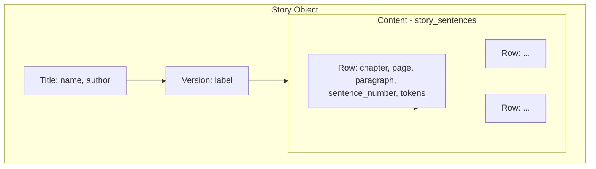

# Unify Story as Single Object (Chapters, Pages, Paragraphs, Words)

## Problem

StoryDetail currently treats "page mode" and "editor mode" as separate concepts:

- **Persisted sentences** – from DB, rendered in one way
- **Editor row** – `editorTokens` in-memory, different UI path when `isEmptyStory`
- **Editing state** – `editingSentenceId` vs `editingEditorOpen` – two editing flows

This splits the story into two mental models instead of one.

## Target: Story Object = Supabase Schema

The story should be modeled as a single object aligned with the DB:



**Each row** has the same shape: `chapter_number`, `page_number`, `paragraph_number`, `sentence_number`, `sentence_text`, `tokens_array`. Persisted rows have `id`; draft rows do not.

---

## 1. Define StoryRow Type (Single Shape)

**File:** `src/lib/storyModel.ts` (new)

```ts
import type { SentenceToken } from '../db/schema'

/** A story row (sentence). Same shape for persisted and draft. */
export type StoryRow = {
  id: number | null
  version_id: number
  chapter_number: number | null
  page_number: number | null
  paragraph_number: number | null
  sentence_number: number
  sentence_text: string
  tokens_array: SentenceToken[] | null
}

export function isPersistedRow(row: StoryRow): row is StoryRow & { id: number } {
  return row.id != null
}
```

---

## 2. Unified Content Array

Instead of `sentences` (DB) vs `editorTokens` (special case):

- **Persisted rows** – from `story_sentences` query
- **Draft row** – when story is empty OR when adding a new sentence: `{ id: null, tokens_array: [...], ... }`

Single array: `storyRows: StoryRow[]`

- Empty story: `[{ id: null, sentence_number: 1, page_number: 1, tokens_array: [], ... }]`
- Story with content: DB rows + optional draft at end for "add new"

---

## 3. Single SentenceRow Component

**New file:** `src/components/SentenceRow.tsx`

Renders one row. Receives:

- `row: StoryRow`
- `posTypes`, `chunkPatterns`, etc.
- `onSave`, `onDelete` (for persisted: mutate; for draft: insert/clear)

**Same UI for both:**

- TokenDisplay with `source: story_sentence | editor` (based on `row.id`)
- Double-click → edit textarea
- Star, phrase, pattern buttons
- Reorder (persisted only)

No branching on "is this the editor row?" – it's just a row with `id === null`.

---

## 4. Refactor StoryDetail to Use Story Rows

**StoryDetail:**

1. Load `sentences` from DB (as `StoryRow[]`)
2. Compute `storyRows`:
   - If empty: `[draftRow]`
   - If not empty: `sentences` + optional `draftRow` at end (for "add sentence")
3. Single render: `storyRows.map(row => <SentenceRow key={row.id ?? 'draft'} row={row} ... />)`
4. Remove `editorTokens`, `editingEditorOpen`, `editorInsertIndex` – replaced by `draftRow` in `storyRows`
5. Remove `sentenceId === 'editor'` branches – draft row has `id: null`, same component handles it

---

## 5. TokenSource for Rows

For TokenDisplay inside SentenceRow:

- Persisted: `source: { type: 'story_sentence', sentenceId: row.id }`
- Draft: `source: { type: 'editor', tokens: row.tokens_array ?? [], onTokensChange: (t) => updateDraftRow(...) }`

Same TokenDisplay, same POS-on-click behavior; only the source differs.

---

## 6. View Modes (Page vs All)

`viewMode` and `currentPage` are **view filters** on the same `storyRows`:

- `page` view: filter rows by `page_number === currentPage`
- `all` view: show all rows

No separate "editor layout" – the layout is driven by the story structure (chapters, pages, paragraphs).

---

## File Summary

| Action | File |
|--------|------|
| Create | `src/lib/storyModel.ts` – StoryRow type, helpers |
| Create | `src/components/SentenceRow.tsx` – single row renderer |
| Refactor | [src/pages/StoryDetail.tsx](src/pages/StoryDetail.tsx) – use storyRows, remove editorTokens/editingEditorOpen split |

---

## Migration Order

1. Add `storyModel.ts` with StoryRow type
2. Create SentenceRow component (extract from StoryDetail row render)
3. Refactor StoryDetail to build `storyRows` and map to SentenceRow
4. Remove editorTokens, editingEditorOpen, editorInsertIndex
5. Ensure draft row uses same TokenDisplay + source flow as persisted rows
